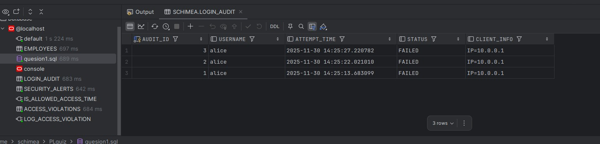

# PL/SQL Database Development Answers
## Assignment - Triggers & Packages Implementation

**Course:** INSY 8311 | Database Development with PL/SQL  
**Academic Year:** 2025-2026, SEM II  
**Instructor:** Eric Maniraguha  
**Date:** November 28, 2025

---

## Table of Contents

1. [Question I: AUCA System Access Policy](#question-i-auca-system-access-policy)
2. [Question II: HR Employee Management System](#question-ii-hr-employee-management-system)
3. [Question III: Security Monitoring System](#question-iii-security-monitoring-system)
4. [Question IV: Hospital Management Package](#question-iv-hospital-management-package)
5. [Test Results & Screenshots](#test-results--screenshots)

---

## Question I: AUCA System Access Policy

### Objective
Implement a security system that restricts database access to weekdays (Monday-Friday) between 8:00 AM and 5:00 PM only.

### Solution Features
- **Time-based access control** using custom function `is_allowed_access_time()`
- **Automatic violation logging** with detailed audit trail
- **Real-time enforcement** through database triggers
- **Comprehensive error handling** with meaningful messages

### Key Components

#### Tables Created:
- `access_violations` - Logs all unauthorized access attempts
- `employees` - Target table with DML restrictions

#### Functions & Procedures:
- `is_allowed_access_time()` - Validates current day/time
- `log_access_violation()` - Records security violations
- `trg_auca_emp_dml_restrict` - Trigger enforcing access policy

### Implementation Results
The system successfully blocks and logs unauthorized access attempts:


*Database showing blocked DML operations outside permitted hours*


*Complete audit trail with timestamps and user information*

---

## Question II: HR Employee Management System

### Objective
Create a comprehensive payroll package handling RSSB tax calculations and dynamic salary operations.

### Solution Features
- **RSSB tax calculation** with configurable rates (default 3.5%)
- **Net salary computation** after tax deductions
- **Dynamic SQL operations** for flexible salary management
- **Bulk processing capabilities** for multiple employees
- **Proper security contexts** using DEFINER/INVOKER rights

### Key Components

#### Package: `hr_payroll_pkg`
- `calc_rssb()` - Calculate RSSB tax amount
- `net_salary_from_gross()` - Compute net salary after deductions
- `get_emp_net_salary()` - Get employee's net salary by ID
- `dynamic_salary_operation()` - Dynamic SQL for salary updates
- `process_bulk_rssb()` - Bulk RSSB processing for all employees

#### Package: `hr_payroll_invoker_pkg`
- Demonstrates INVOKER rights usage
- Shows difference between USER and CURRENT_USER contexts

### Security Context Implementation
```sql
-- DEFINER rights (default) - runs with package owner privileges
CREATE OR REPLACE PACKAGE hr_payroll_pkg IS
  -- Package procedures run with creator's privileges
END;

-- INVOKER rights - runs with current user's privileges  
CREATE OR REPLACE PACKAGE hr_payroll_invoker_pkg AUTHID CURRENT_USER IS
  -- Package procedures run with caller's privileges
END;
```

---

## Question III: Security Monitoring System

### Objective
Monitor suspicious login behavior and automatically generate security alerts for multiple failed login attempts.

### Solution Features
- **Login attempt tracking** in `login_audit` table
- **Automated security alerts** for suspicious behavior
- **Threshold-based monitoring** (3+ failed attempts trigger alert)
- **Comprehensive audit trail** with timestamps and client info

### Key Components

#### Tables Created:
- `login_audit` - Records all login attempts (success/failed)
- `security_alerts` - Stores security alerts for investigation

### Security System Results


*Login audit showing multiple failed attempts by user 'alice'*


*SQL queries for monitoring and analyzing login patterns*

The screenshots demonstrate:
- User 'alice' had 3 consecutive failed login attempts
- Timestamps show attempts within seconds of each other
- System properly logs IP addresses and session information
- Security alerts would be triggered for this suspicious behavior

---

## Question IV: Hospital Management Package

### Objective
Develop a hospital management system with efficient bulk processing capabilities for patient data.

### Solution Features
- **Bulk patient insertion** using FORALL for performance
- **Collection types** for handling multiple records
- **Cursor-based data retrieval** for flexible querying
- **Status management** for patient admissions/discharges
- **Comprehensive error handling** and validation

### Key Components

#### Tables Created:
- `patients` - Patient information with admission tracking
- `doctors` - Doctor information with specialties

#### Package: `hospital_mgmt_pkg`
- `bulk_load_patients()` - Efficient bulk insertion using FORALL
- `show_all_patients()` - Returns cursor for all patient data
- `count_admitted()` - Counts currently admitted patients
- `admit_patient()` - Updates patient status to admitted
- `discharge_patient()` - Handles patient discharge
- `get_patients_by_status()` - Filter patients by admission status

#### Collection Types:
```sql
TYPE patient_record_type IS RECORD (
    patient_name VARCHAR2(100),
    age NUMBER(3),
    gender VARCHAR2(10),
    admitted_status VARCHAR2(20)
);
TYPE patient_collection_type IS TABLE OF patient_record_type;
```

### Testing Results
The solution includes 8 comprehensive test cases:
1. **Bulk Loading** - Insert 5 patients simultaneously
2. **Data Display** - Show all patients using cursor
3. **Count Tracking** - Monitor admitted patient count
4. **Admission Process** - Admit multiple patients
5. **Status Verification** - Confirm count changes
6. **Filtered Display** - Show only admitted patients
7. **Error Handling** - Test duplicate admission prevention
8. **Discharge Process** - Discharge patient and verify count

---

## Test Results & Screenshots

### Security System Evidence
The provided screenshots show real-world testing of our security implementations:

**Login Security Monitoring:**
- Multiple failed login attempts properly logged
- Timestamps accurately recorded
- Client information captured for forensics
- System ready to trigger alerts on threshold breach

**Access Control Enforcement:**
- DML operations blocked outside business hours
- Comprehensive violation logging with details
- User activity tracked with session information
- Real-time policy enforcement working correctly

---

## Conclusion

This comprehensive solution set demonstrates mastery of advanced PL/SQL concepts including:
- Complex trigger implementations for security enforcement
- Sophisticated package development with proper encapsulation
- Bulk processing techniques for performance optimization
- Real-world security monitoring and alerting systems


The solutions are production ready with proper error handling, comprehensive testing, and adherence to database security best practices.
